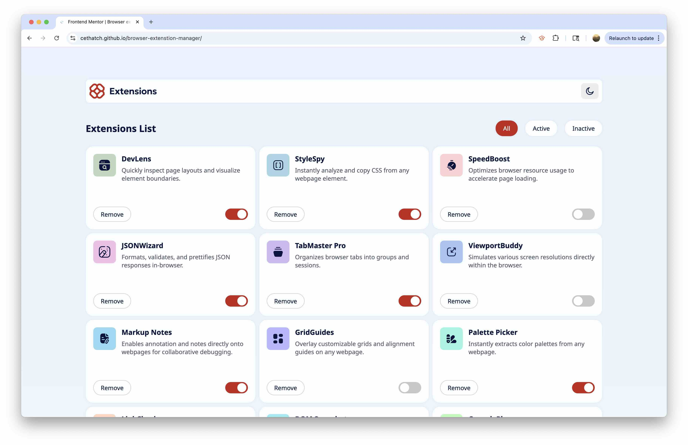
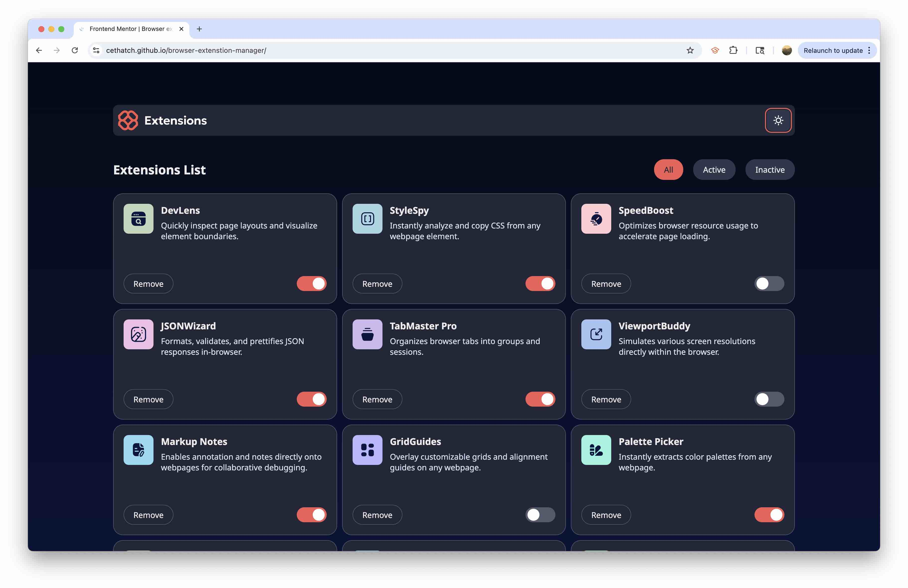
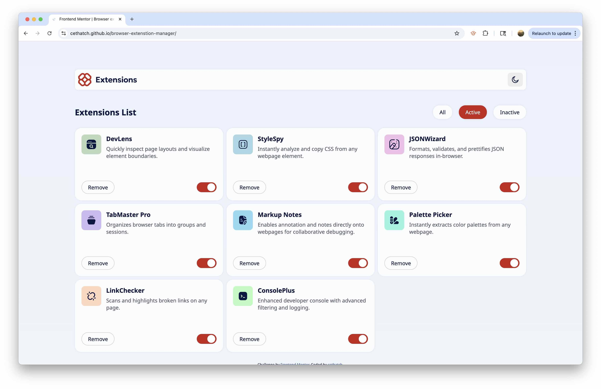
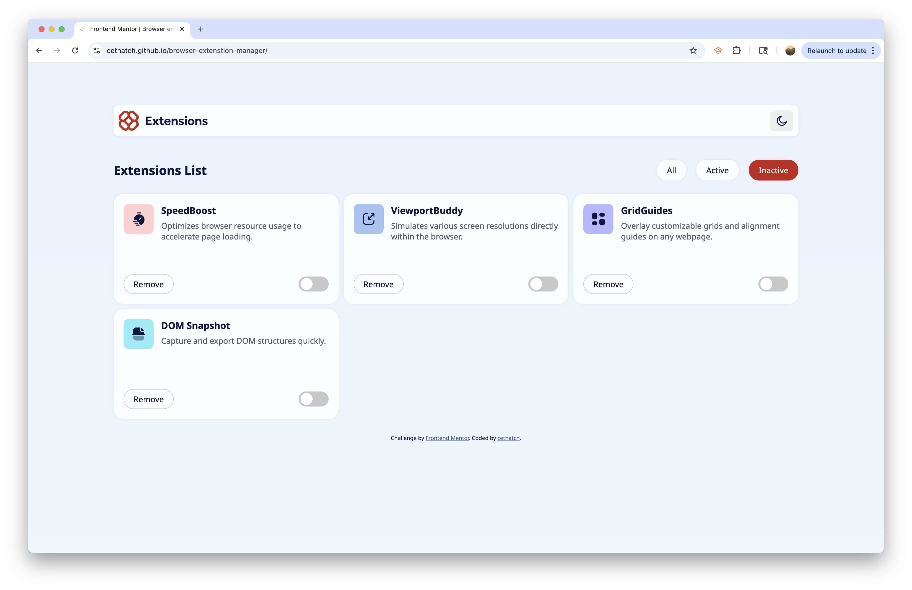
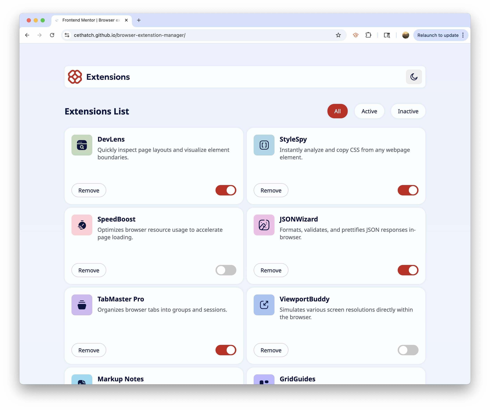
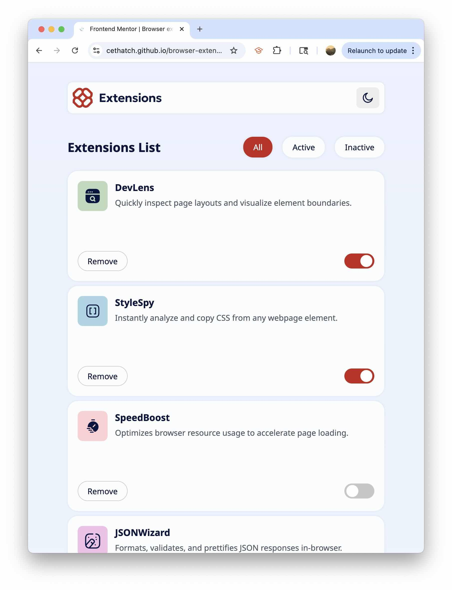
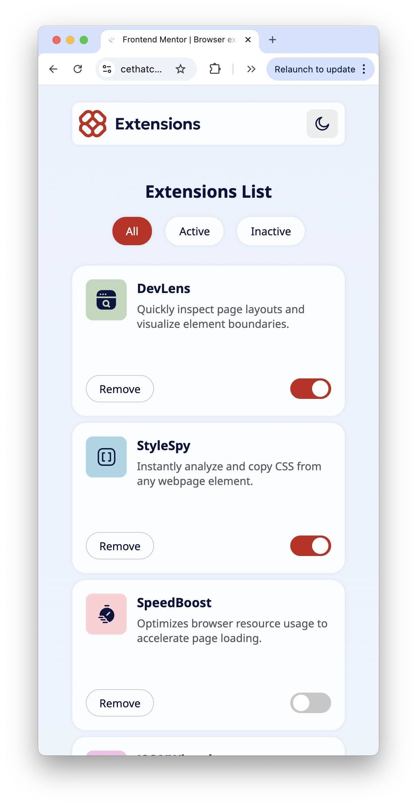

# Frontend Mentor - Browser extensions manager UI solution

This is a solution to the [Browser extensions manager UI challenge on Frontend Mentor](https://www.frontendmentor.io/challenges/browser-extension-manager-ui-yNZnOfsMAp). Frontend Mentor challenges help you improve your coding skills by building realistic projects. 

## Table of contents

- [Overview](#overview)
  - [The challenge](#the-challenge)
  - [Screenshot](#screenshot)
  - [Links](#links)
- [My process](#my-process)
  - [Built with](#built-with)
  - [What I learned](#what-i-learned)
  - [Continued development](#continued-development)
  - [Useful resources](#useful-resources)
- [Author](#author)
- [Acknowledgments](#acknowledgments)

## Overview

### The challenge

Users should be able to:

- Toggle extensions between active and inactive states
- Filter active and inactive extensions
- Remove extensions from the list
- Select their color theme
- View the optimal layout for the interface depending on their device's screen size
- See hover and focus states for all interactive elements on the page

#### Goal design given:


### Screenshots

#### Light mode:


#### Dark mode:


#### Active filtered:


#### Inactive filtered:


#### Dynamic columns that respond to window resizing:




### Links

- Live Site URL: [My solution live URL here](https://cethatch.github.io/browser-extenstion-manager/)

## My process

### Built with

- Semantic HTML5 markup
- CSS custom properties
- Flexbox
- CSS Grid
- Mobile-first workflow
- SVG Editor

### What I learned

A main highlight from this project was the opportunity to familiarize myself with the CSS grid layout. In previous projects, I have used Flexbox, which in this case, didn't allow me to achieve the desired layout. Using grid was simple, and allowed me to achieve dynamic resizing based on viewport size and a left-justified final row. 

```css
.tile-container {
    display: grid;
    width: 100%;
    margin: 0 auto;
    grid-template-columns: repeat(auto-fill, minmax(350px, 1fr)); 
    gap: 10px; 
}
```

Styling both light and dark modes within a single style sheet was a challenge I had yet to face in previous work. My main goal when approaching this was to avoid redundant CSS from having multiple stylesheets. Instead, I made use of CSS variables, and defined them based on which mode was active. For example:

This defines a light gradient for the ligh-mode background:
```css
body.light-mode {
    --bkg-color: linear-gradient(180deg, #EBF2FC 0%, #EEF8F9 100%);
}
```

And this defines a dark gradient for the dark-mode background:
```css
body.dark-mode {
    --bkg-color: linear-gradient(180deg, #040918 0%, #091540 100%);
}
```

Both utilize the same variable name ```---bkg-color``` which can be used to define the background color for the body element.

### Continued development

In future projects I want to keep improving my CSS. At my current skill level, I am not making use of CSS inheritence fully. With more practice, I want to improve this and reduce the redundancy in my style sheets. 

Additionally, in later projects, I would like to practice using React.js. I have used the React framework before, and would appreciate more opportunities to get more familiar.

### Useful resources

- [CSS Grid Layout](https://css-tricks.com/snippets/css/complete-guide-grid/)
- [SVG Editor](https://svgedit.netlify.app/editor/index.html) - The given logo was not well-suited for dark mode, as the font color was dark and did not stand out with a dark background. I utilized an open-source SVG editor to adapt the given logo for dark mode. 
- [W3 Schools Toggle Tutorial](https://www.w3schools.com/howto/howto_css_switch.asp) - The activate/inactivate toggle switch was a challenge for me, and I derived my solution from this tutorial. 

## Author

- GitHub - [Christine Thatcher](https://github.com/cethatch)
- LinkedIn - [Christine Thatcher](https://www.linkedin.com/in/cethatcher/)
- Frontend Mentor - [@cethatch](https://www.frontendmentor.io/profile/cethatch)
